# Avl-task

## Milestone 1
1. Setup Google Cloud Instance using terraform
   - To deploy GCP instance on top of Google cloud i have created terraform scripts with best practices like seperation of modules in between root and calling. All my terraform code is reside in terraform dir. Attaching screenshot below for reference
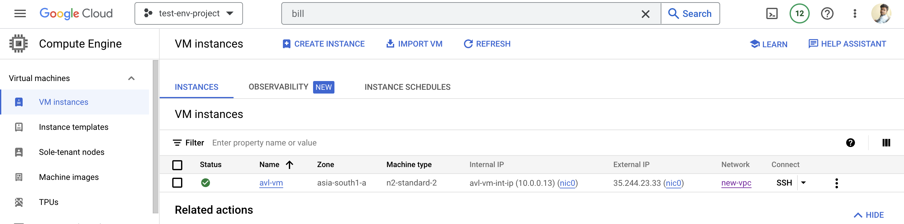

1. ### Docker install 
   ```
   1. sudo apt-get update -y
   2. sudo apt install apt-transport-https ca-certificates curl software-properties-common
   3. curl -fsSL https://download.docker.com/linux/ubuntu/gpg | sudo apt-key add -
   4. sudo add-apt-repository "deb [arch=amd64] https://download.docker.com/linux/ubuntu bionic stable"
   5. sudo apt update
   6. sudo apt install docker-ce
   7. sudo systemctl status docker
   8. sudo groupadd docker
   9. sudo usermod -aG docker $USER
   ```
Attaching Screenshot below for reference


3. ### Create docker image and run 
   ```
    1. sudo docker build -t docker.io/avl-task:v1 .
    2. sudo docker run -dit --name g1 -p 5000:5000 avl-task:v1 
   ```

Attaching Screenshot below for reference

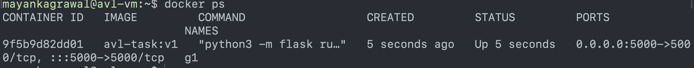 

4. ### Access of application
   1. For accessing of docker application i have allowd only my ip in source ranges for ssh,jenkins and docker so that i only can access the application from outside world. If we have to open the application for all we can change the source ranges to 0.0.0.0/0 in below command   
   ```
   gcloud compute firewall-rules create new-fw --allow=tcp:22,tcp:8080,tcp:5000 --description="Allow port for ssh , jenkins and docker" --network=new-vpc --source-ranges=49.36.80.28/32 --target-tags=allow-ssh,allow-jenkins,allow-docker --project=test-env-project-373606
   ```

Attaching Screenshot below for reference

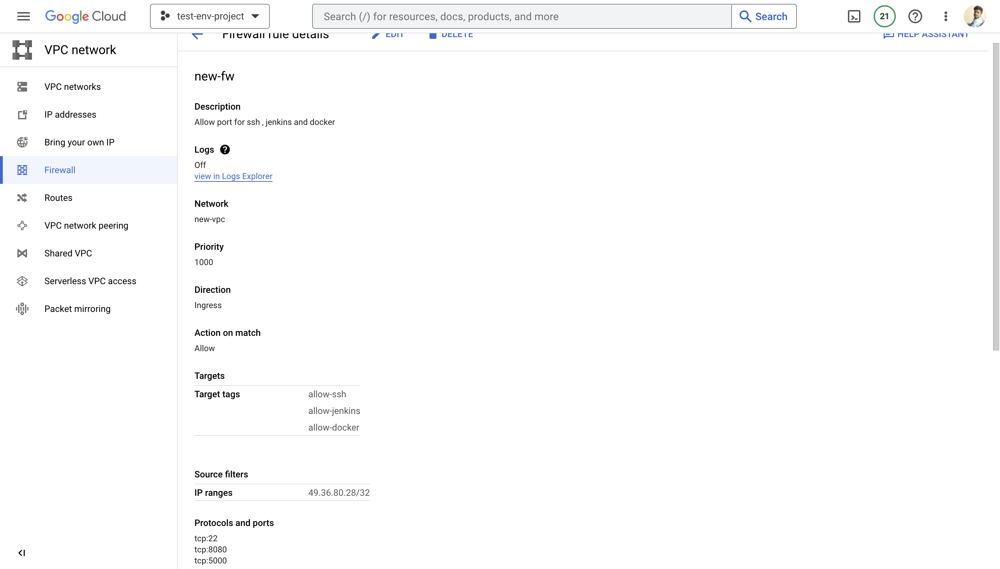

Accessing the docker application. Attaching screenshot below

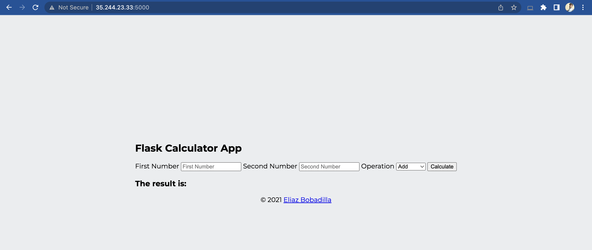

## Milestone 2
1. ### setup jenkins
   ```
   1. sudo apt-get update
   2. sudo apt-get install openjdk-11-jdk
   3. java -version
   4. curl -fsSL https://pkg.jenkins.io/debian-stable/jenkins.io.key | sudo tee \
   /usr/share/keyrings/jenkins-keyring.asc > /dev/null
   5. echo deb [signed-by=/usr/share/keyrings/jenkins-keyring.asc] \
   https://pkg.jenkins.io/debian-stable binary/ | sudo tee \
   /etc/apt/sources.list.d/jenkins.list > /dev/null
   6. sudo apt-get update
   7. sudo apt-get install jenkins
   8. sudo systemctl start jenkins.service
   9. sudo systemctl status jenkins

    ```

Attaching Screenshot below for reference

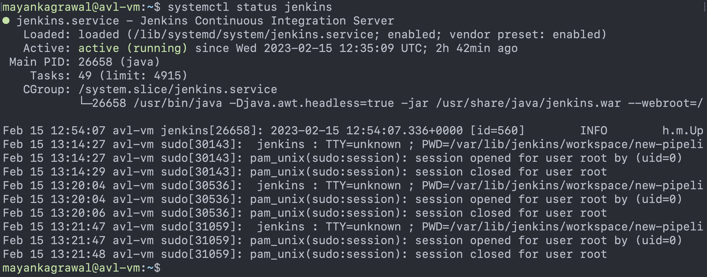

2. ### Create CI/CD
   - I have created jenkinsfile to complete this task. In this task i have created 3 stages first is clone the flask-calculator repo into my workspace, second is create docker build and push it onto dockerhub, third is run docker container.
   - I have created this jenkinsfile very dynamic like i used parameters so that any user can create and run container with there own name.
   - I have used jenkins credentials to store the secret for login in dockerhub 
   - I have also used jenkins github webhook trigger so that new changes automatically deployed.

Attaching Screenshots below for reference

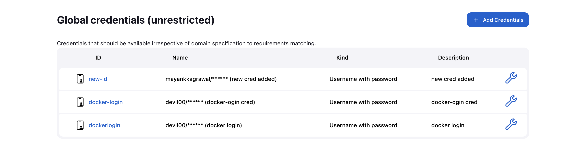

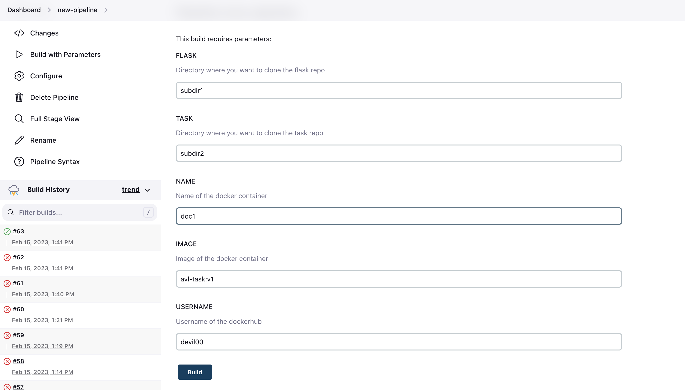

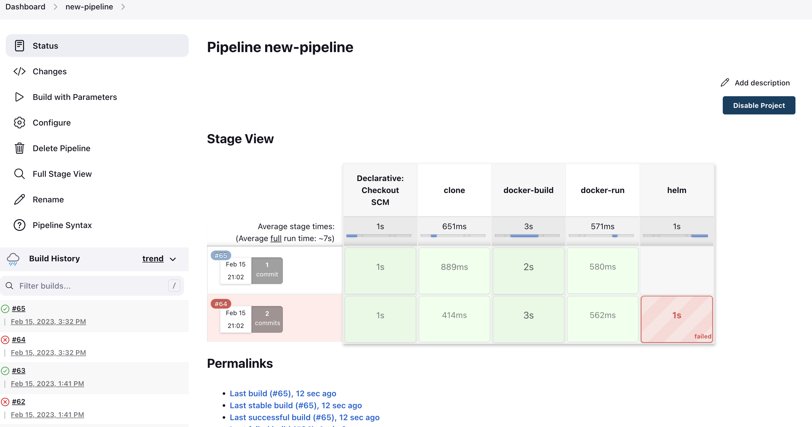

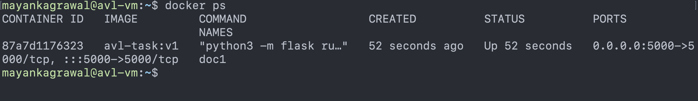

3. ### Accees the application using LoadBalancer
   - For accessing the application using lb first we need to create unamanged instance group because in google cloud using instance as a backend in lb won't possible without attaching instance with instance group.
  
Attaching Screenshots below for reference

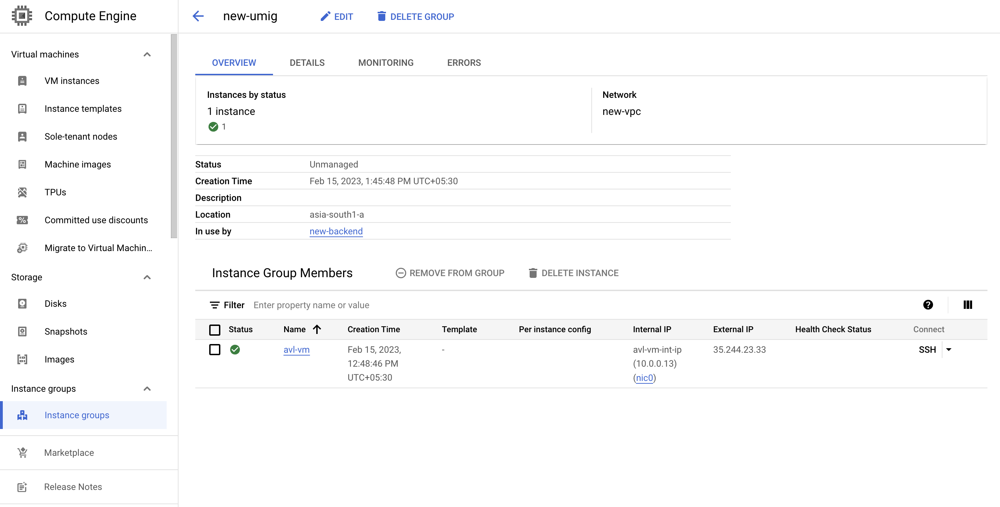

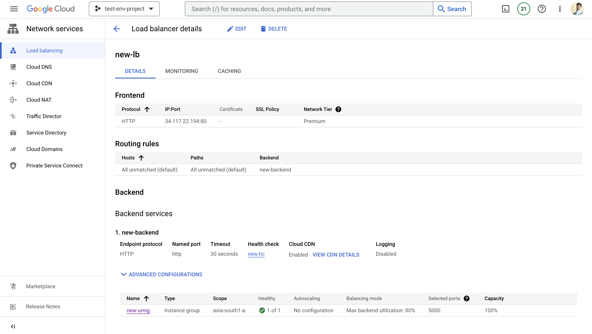

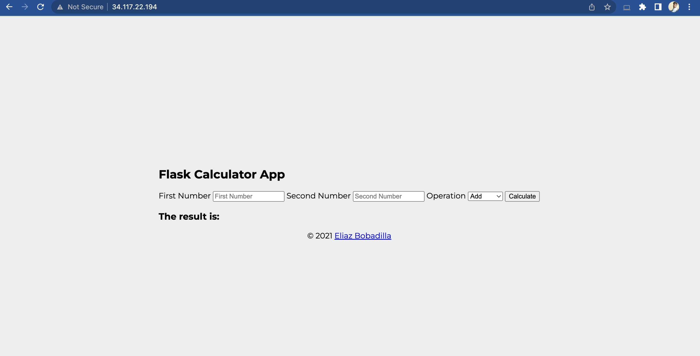

## Milestone 3

1. ### create GKE cluster using gcloud command
   ```
    gcloud beta container --project "test-env-project-373606" clusters create "new-cluster" --zone "asia-south1-a" --no-enable-basic-auth --cluster-version "1.22.16-gke.1300" --release-channel "None" --machine-type "n2-standard-2" --image-type "COS_CONTAINERD" --disk-type "pd-standard" --disk-size "100" --metadata disable-legacy-endpoints=true --scopes "https://www.googleapis.com/auth/devstorage.read_only","https://www.googleapis.com/auth/logging.write","https://www.googleapis.com/auth/monitoring","https://www.googleapis.com/auth/servicecontrol","https://www.googleapis.com/auth/service.management.readonly","https://www.googleapis.com/auth/trace.append" --max-pods-per-node "110" --num-nodes "1" --logging=SYSTEM,WORKLOAD --monitoring=SYSTEM --enable-private-nodes --master-ipv4-cidr "172.22.0.0/28" --enable-ip-alias --network "projects/test-env-project-373606/global/networks/new-vpc" --subnetwork "projects/test-env-project-373606/regions/asia-south1/subnetworks/new-subnet" --no-enable-intra-node-visibility --default-max-pods-per-node "110" --enable-master-authorized-networks --addons HorizontalPodAutoscaling,HttpLoadBalancing,GcePersistentDiskCsiDriver --enable-autoupgrade --enable-autorepair --max-surge-upgrade 1 --max-unavailable-upgrade 0 --labels owner=mayank --enable-shielded-nodes --node-locations "asia-south1-a"
   ```
Attaching Screenshot below for reference

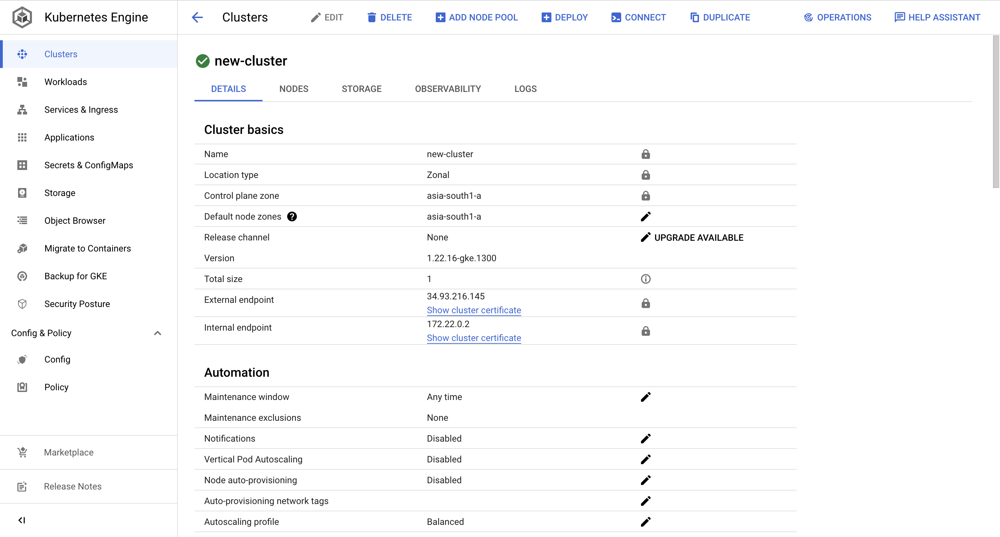

2. ### install kubectl to access GKE cluster 
   ```
    apt-get -y install apt-transport-https ca-certificates gnupg \
    && echo "deb [signed-by=/usr/share/keyrings/cloud.google.gpg] https://packages.cloud.google.com/apt cloud-sdk main" | tee -a /etc/apt/sources.list.d/google-cloud-sdk.list \
    && curl https://packages.cloud.google.com/apt/doc/apt-key.gpg | apt-key --keyring /usr/share/keyrings/cloud.google.gpg add - \
    && apt-get -y update && apt-get -y install google-cloud-cli && apt-get -y install google-cloud-sdk-gke-gcloud-auth-plugin \
    && curl -LO "https://dl.k8s.io/release/$(curl -L -s https://dl.k8s.io/release/stable.txt)/bin/linux/amd64/kubectl" \
    && sudo install -o root -g root -m 0755 kubectl /usr/local/bin/kubectl \
    &&
   ```
Attaching Screenshot below for reference

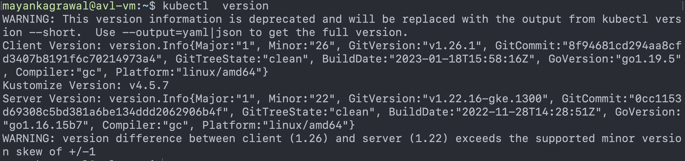

3. ### create helm 
   1. Helm Install 
      ```
      curl https://raw.githubusercontent.com/helm/helm/master/scripts/get-helm-3 | bash
      ```
    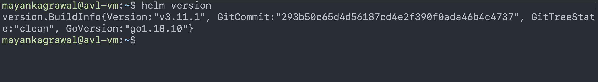
    2. Create helm app
      ```
      helm create app
      ```
Attaching Screenshot below for reference

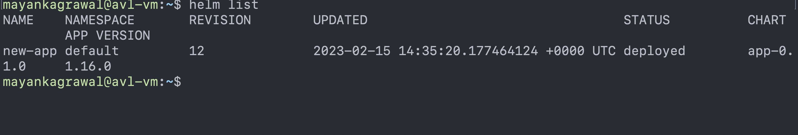

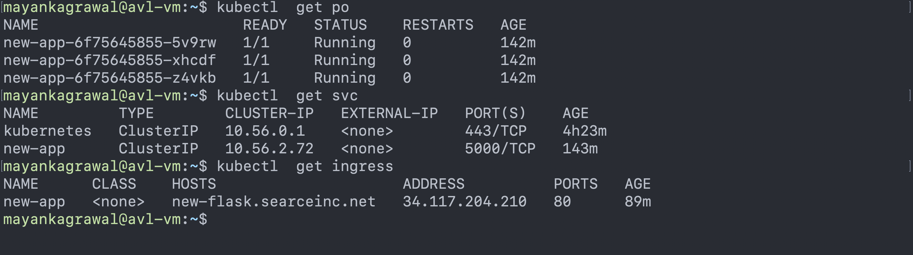

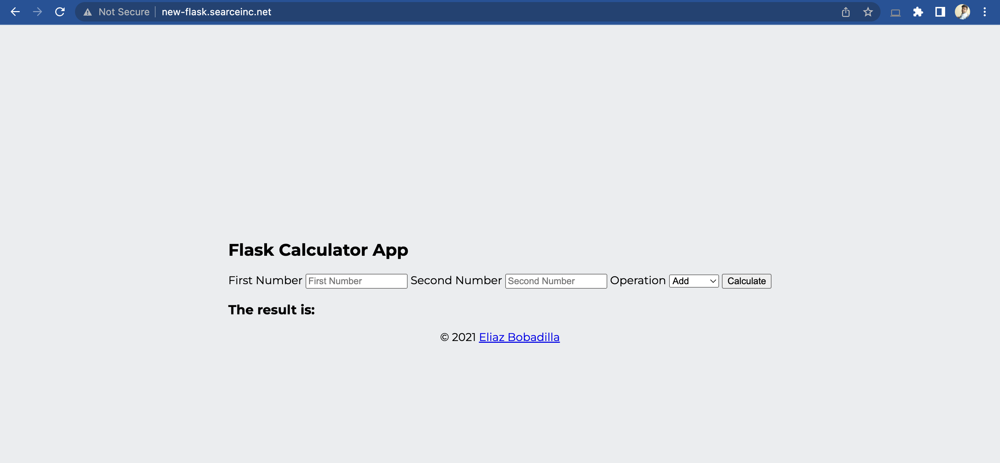

